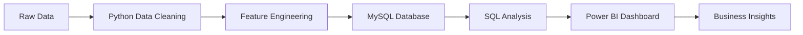

# 🛒 Retail Data Analysis Dashboard

<div align="center">

# 📊 End-to-End Retail Business Analytics Project

### Transforming Raw Retail Data into Actionable Business Insights using Python, MySQL & Power BI


</div>

---

## 🎯 Project Overview

The **Retail Data Analysis Dashboard** is an end-to-end Business Intelligence project designed to analyze retail operations and generate actionable insights from sales, customers, products, and regional performance data.

This project demonstrates a complete analytics pipeline:

✅ Data Cleaning & Transformation using Python

✅ Relational Database Design using MySQL

✅ Data Analysis using SQL

✅ Interactive Dashboard Development using Power BI

✅ Business Insight Generation

---

## 🚀 Business Problem

Retail companies generate large volumes of transactional data every day. Without proper analysis, identifying trends, profitable products, customer behavior, and regional performance becomes difficult.

This project helps answer critical business questions:

- Which products generate the highest revenue?
- Which regions contribute the most profit?
- Who are the most valuable customers?
- What sales channels perform best?
- How can inventory and sales strategies be improved?

---

## 🛠️ Tech Stack

| Tool | Purpose |
|--------|---------|
| Python | Data Cleaning & Preprocessing |
| Pandas | Data Manipulation |
| NumPy | Numerical Analysis |
| MySQL | Data Storage & Querying |
| SQL | Business Analysis |
| Power BI | Dashboard Development |
| Git & GitHub | Version Control |

---

# 📂 Dataset Description

The project uses multiple datasets:

| Dataset | Description |
|----------|------------|
| Orders | Customer Orders |
| Sales | Revenue & Profit Data |
| Products | Product Information |
| Customers | Customer Details |
| Suppliers | Supplier Information |
| Inventory | Stock Management |

The datasets were cleaned, transformed, and integrated into a unified analytical model.

---

# 🔄 Project Workflow



---

# 🧹 Data Cleaning & Transformation

### Tasks Performed

- Handled Missing Values
- Removed Duplicate Records
- Standardized Column Names
- Converted Data Types
- Date Formatting
- Feature Engineering
- Data Validation

### Features Created

- Profit
- Profit Margin
- Monthly Revenue
- Customer Revenue
- Sales KPIs
- Product KPIs

---

# 🗄️ Database Design (MySQL)

### Database Activities

- Created Relational Database Schema
- Defined Primary Keys
- Defined Foreign Keys
- Established Table Relationships
- Optimized Analytical Queries

### Tables Used

```sql
Customers
Orders
Sales
Products
Suppliers
Inventory
```

---

# 📊 Power BI Dashboards

## 📍 Executive Overview


### Key KPIs

| KPI | Value |
|------|------|
| Total Sales | 46M |
| Total Customers | 4K |
| Total Profit | 4.65M |
| Total Orders | 15K |
| Profit Margin | 10.03% |

### Dashboard Features

- Monthly Sales Trends
- Profit Analysis
- Category Performance
- Sales Channel Analysis
- KPI Monitoring

---

## 🌍 Regional Analysis


### Highlights

🏆 Top Sales Region → West

🏆 Highest Profit Region → West

🏙️ Total Cities → 12

### Analysis Included

- Regional Sales Distribution
- Profit Comparison
- City-wise Performance
- Geographic Analysis

---

## 📦 Product Performance


### Highlights

📈 Top Selling Category → Clothing

💻 Best Selling Subcategory → Laptop

📦 Products Sold → 45K

💰 Average Product Profit → 311.70

### Analysis Included

- Product Rankings
- Category Performance
- Profitability Analysis
- Quantity vs Profit

---

## 👥 Customer Behaviour Analysis


### Highlights

👤 Total Customers → 4K

💰 Average Customer Spending → 11.90K

🌐 Online Sales → 49.98%

🏆 Top Customer Revenue → 49K

### Analysis Included

- Customer Segmentation
- Spending Patterns
- Payment Methods
- Customer Revenue Analysis

---

# 📈 Key Business Insights

### Sales Insights

📌 West region contributes the highest sales and profit.

📌 Monthly sales demonstrate steady growth patterns.

### Product Insights

📌 Clothing category dominates sales volume.

📌 Laptop subcategory generates strong revenue.

### Customer Insights

📌 A small group of high-value customers contributes a significant share of total revenue.

📌 Online and Offline channels perform almost equally.

### Regional Insights

📌 Delhi, Bangalore, and Chennai are major revenue-generating cities.

📌 Regional analysis reveals expansion opportunities in underperforming markets.

---

# 📁 Project Structure

```bash
Retail-Data-Analysis/
│
├── data/
│
├── python/
│   ├── data_cleaning.py
│   ├── feature_engineering.py
│   └── eda_analysis.py
│
├── sql/
│   ├── database_schema.sql
│   ├── retail_queries.sql
│   └── analytical_views.sql
│
├── powerbi/
│   └── Retail_Dashboard.pbix
│
├── images/
│   ├── executive_overview.png
│   ├── regional_analysis.png
│   ├── product_analysis.png
│   └── customer_analysis.png
│
├── requirements.txt
├── README.md
└── LICENSE
```

---

# 🚀 How to Run

## Clone Repository

```bash
git clone https://github.com/yourusername/Retail-Data-Analysis.git
```

## Install Dependencies

```bash
pip install -r requirements.txt
```

## Run Data Cleaning

```bash
python python/data_cleaning.py
```

## Import Data into MySQL

1. Create Database
2. Execute Schema Script
3. Import Cleaned Data

## Open Power BI Dashboard

```text
powerbi/Retail_Dashboard.pbix
```

---

# 📊 Skills Demonstrated

### Data Analysis

- Data Cleaning
- Data Transformation
- Exploratory Data Analysis
- Feature Engineering

### SQL

- Joins
- Aggregate Functions
- Window Functions
- Database Design

### Power BI

- KPI Cards
- Interactive Dashboards
- DAX Measures
- Business Reporting

### Business Analytics

- Sales Analysis
- Customer Analytics
- Product Analytics
- Regional Performance Analysis

---

# 🔮 Future Enhancements

- 📈 Sales Forecasting
- 🤖 Product Recommendation System
- ⚡ Real-Time Data Pipeline
- ☁️ Cloud Database Integration
- 🌐 Power BI Service Deployment

---

# 👨‍💻 Author

## Shridhar Patil

🎓 Computer Science Engineer

📊 Data Analyst | Data Scientist | Business Intelligence Enthusiast

📧 shridharpatil0513@gmail.com

🔗 GitHub: https://github.com/Shridharpatil1958

---

# ⭐ Support

If you found this project useful:

⭐ Star this Repository

🍴 Fork this Repository

📢 Share with Others

🤝 Contribute Improvements

---

<div align="center">

### 📊 Turning Retail Data into Actionable Business Insights

**Made with ❤️ by Shridhar Patil**

</div>
