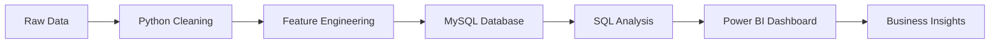

# 🛒 Retail Data Analysis Dashboard

<div align="center">

# 📊 End-to-End Retail Business Analytics Project

### Transforming Raw Retail Data into Actionable Business Insights using Python, MySQL & Power BI


</div>

---

## 🎯 Project Overview

The **Retail Data Analysis Dashboard** is an end-to-end Business Intelligence project designed to analyze sales performance, customer behavior, product profitability, and regional trends.

This project demonstrates a complete analytics pipeline:

✅ Data Cleaning using Python

✅ Data Storage & Querying using MySQL

✅ Dashboard Development using Power BI

✅ KPI Monitoring & Business Insights

✅ Customer, Product & Regional Analysis

---

## 🚀 Business Problem

Retail organizations generate large volumes of transactional data every day. Without proper analysis, identifying growth opportunities and improving operational efficiency becomes difficult.

This project helps answer critical business questions:

- Which products generate the highest revenue?
- Which regions contribute the most profit?
- Who are the most valuable customers?
- How do online and offline channels compare?
- What opportunities exist for business growth?

---

## 🛠️ Tech Stack

| Tool | Purpose |
|--------|---------|
| Python | Data Cleaning & Transformation |
| Pandas | Data Analysis |
| NumPy | Numerical Computing |
| MySQL | Data Storage & Querying |
| SQL | Business Queries |
| Power BI | Dashboard & Reporting |
| Git & GitHub | Version Control |

---

## 📂 Dataset Description

The project integrates multiple business datasets:

| Dataset | Description |
|----------|------------|
| Orders | Customer orders |
| Sales | Revenue and profit information |
| Products | Product catalog |
| Customers | Customer information |
| Suppliers | Supplier details |
| Inventory | Inventory management |

---

## 🔄 Project Workflow



---

# 📊 Executive Overview Dashboard


### Key KPIs

| KPI | Value |
|------|------|
| Total Sales | 46M |
| Total Profit | 4.65M |
| Total Customers | 4K |
| Total Orders | 15K |
| Profit Margin | 10.03% |

### Dashboard Features

- Monthly Sales Trend
- Category-wise Sales Analysis
- Profit Tracking
- Sales Channel Performance
- Executive KPI Monitoring

---

# 🌍 Regional Analysis Dashboard


### Key Insights

🏆 Top Sales Region → **West**

🏆 Highest Profit Region → **West**

🏙️ Total Cities Covered → **12**

### Dashboard Features

- Regional Sales Distribution
- Profit by Region
- City-wise Sales Analysis
- Geographic Performance Metrics

---

# 📦 Product Performance Dashboard


### Key Insights

📈 Top Selling Category → **Clothing**

💻 Best Selling Subcategory → **Laptop**

📦 Total Products Sold → **45K**

💰 Average Product Profit → **311.70**

### Dashboard Features

- Top Products by Revenue
- Category Performance Analysis
- Product Profitability
- Quantity vs Profit Analysis

---

# 👥 Customer Behaviour Dashboard


### Key Insights

👤 Total Customers → **4K**

💰 Average Spending → **11.90K**

🌐 Online Sales → **49.98%**

🏆 Highest Customer Revenue → **49K**

### Dashboard Features

- Customer Segmentation
- Spending Behavior
- Payment Method Analysis
- Online vs Offline Trends

---

# 📈 Key Business Insights

### Sales Insights

📌 West region contributes the highest sales and profit.

📌 Monthly sales show a stable growth trend.

### Product Insights

📌 Clothing dominates total sales volume.

📌 Laptop category generates significant revenue.

### Customer Insights

📌 High-value customers contribute a major share of overall revenue.

📌 Online and Offline sales channels perform almost equally.

### Regional Insights

📌 Delhi, Bangalore, and Chennai are among the top-performing cities.

📌 Regional analysis reveals expansion opportunities.

---

# 🧹 Data Cleaning & Transformation

### Performed Using Python

✔ Missing Value Handling

✔ Duplicate Removal

✔ Data Type Conversion

✔ Date Formatting

✔ Data Validation

✔ Feature Engineering

### Engineered Features

- Profit
- Profit Margin
- Monthly Sales
- Customer Revenue
- Product KPIs

---

# 🗄️ Database Design

### MySQL Implementation

- Relational Database Schema
- Primary & Foreign Keys
- Data Integrity Checks
- SQL Query Optimization
- Business Analytics Queries

### Database Tables

```sql
Customers
Products
Orders
Sales
Suppliers
Inventory
```

---

# 📁 Project Structure

```bash
Retail-Data-Analysis/
│
├── data/
│
├── python/
│   ├── data_cleaning.py
│   ├── eda_analysis.py
│   └── feature_engineering.py
│
├── sql/
│   ├── database_schema.sql
│   └── business_queries.sql
│
├── powerbi/
│   └── Retail_Dashboard.pbix
│
├── dashboard_screenshots/
│
├── README.md
└── requirements.txt
```

---

# 🚀 How to Run

### Clone Repository

```bash
git clone https://github.com/yourusername/Retail-Data-Analysis.git
```

### Install Dependencies

```bash
pip install -r requirements.txt
```

### Run Python Scripts

```bash
python data_cleaning.py
```

### Load Data into MySQL

- Create Database
- Execute Schema Script
- Import Cleaned Data

### Open Power BI Dashboard

```text
Retail_Dashboard.pbix
```

---

# 📊 Skills Demonstrated

### Data Analysis

- Data Cleaning
- Exploratory Data Analysis
- Business Analytics

### SQL

- Joins
- Aggregations
- Window Functions
- Database Design

### Power BI

- KPI Cards
- DAX Measures
- Interactive Dashboards
- Business Reporting

### Business Intelligence

- Customer Analytics
- Product Analytics
- Regional Analysis
- Sales Performance Monitoring

---

# 🔮 Future Enhancements

- 📈 Sales Forecasting using Machine Learning
- 🤖 Product Recommendation System
- ⚡ Real-Time Data Pipeline
- ☁️ Cloud Database Integration
- 🌐 Power BI Service Deployment

---

# 👨‍💻 Author

## Shridhar Patil

🎓 Computer Science Engineer

📊 Data Analyst | Data Scientist | Business Intelligence Enthusiast

📧 shridharpatil0513@gmail.com

🔗 GitHub: https://github.com/Shridharpatil1958

---

# ⭐ Support

If you found this project useful:

⭐ Star this repository

🍴 Fork this repository

📢 Share with others

🤝 Contribute improvements

---

<div align="center">

### 📊 Turning Retail Data into Business Intelligence

**Made with ❤️ by Shridhar Patil**

</div>
